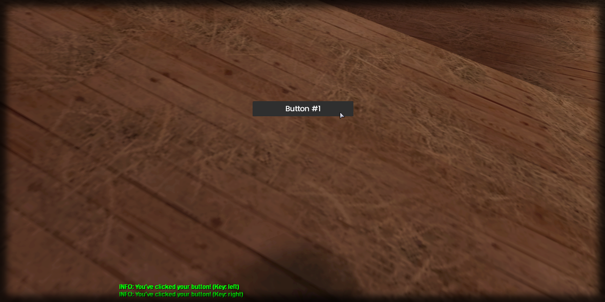

# create

## **Syntax:**

```lua
button create(text, x, y, type, ...Template_Parameters..., [parent = nil], [postGUI = false])
```

### **Parameters:**

* **x** \(float\) : Absolute x coordinate of the button within the container.
* **y** \(float\) : Absolute y coordinate of the button within the container.
* **type** \(string\) : Type of button.
* **Template\_Parameters** : Refer to [Button Types](types/).
* **parent** \(element\) : Supported parent element to use as a container for the button. \(_Optional_\)
* **postGUI** \(bool\) : State whether the UI will be drawn below/over CEGUI. \(_Optional_\)

### **Returns:**

* **button** \(element\) : Created button element.

## **Example:**

```lua
local sX, sY = guiGetScreenSize()
local button_width, button_height = 200, 30
local createdButton = beautify.button.create("Button #1", (sX - button_width)/2, (sY - button_height)/2, "default", button_width, button_height, nil, false)
beautify.setUIVisible(createdButton, true)
addEventHandler("onClientUIClick", createdButton, function(key)
    print("You've clicked your button! (Key: "..key..")")
end)
```



