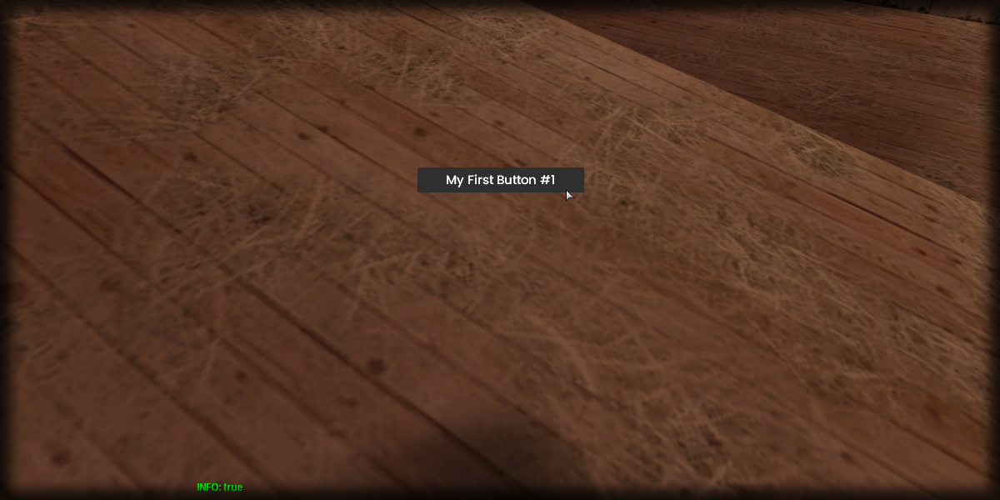

# setText

## **Syntax:**

```lua
state setButtonText(button, text)
```

#### _**\#Counterpart:**_ [_**getButtonText**_](getbuttontext.md)

### **Parameters:**

* **button** \(element\) : Button element you wish to set the text of.
* **text** \(string\) : Text of the button.

### **Returns:**

* **state** \(bool\) : Execution state.

## **Example:**

```lua
local resultState = beautify.button.setButtonText(createdButton, "My First Button #1")
print(tostring(resultState))
```



