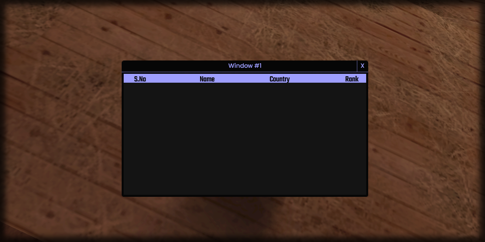

# addGridlistColumn

## **Syntax:**

```lua
column addGridlistColumn(gridlist, name, width)
```

#### _**\#Counterpart:**_ [_**removeGridlistColumn**_](removegridlistcolumn.md)

### **Parameters:**

* **gridlist** \(element\) : Gridlist element you wish to add the column in.
* **name** \(string\) : Name of the column.
* **width** \(float\) : Absolute width of the column.

### **Returns:**

* **column** \(int\) : Added column's index.

## **Example:**

```lua
local columnIndex1 = beautify.gridlist.addGridlistColumn(createdGridlist, "S.No", 75)
local columnIndex2 = beautify.gridlist.addGridlistColumn(createdGridlist, "Name", 250)
local columnIndex3 = beautify.gridlist.addGridlistColumn(createdGridlist, "Country", 100)
local columnIndex4 = beautify.gridlist.addGridlistColumn(createdGridlist, "Rank", 250)
```

