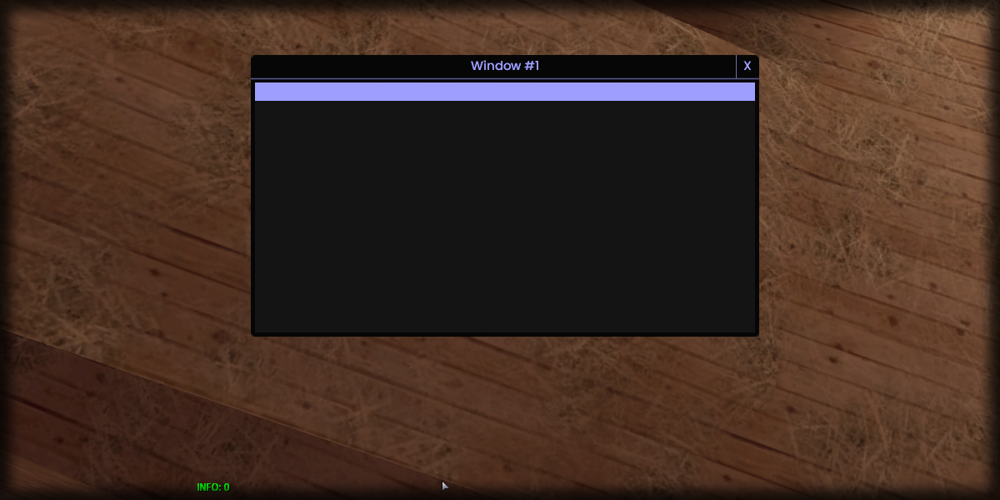

# countColumns

## **Syntax:**

```lua
count countColumns(gridlist)
```

#### _**\#Counterpart:**_ [_**countRows**_](countgridlistrows.md)

### **Parameters:**

* **gridlist** \(element\) : Gridlist element you wish to retrieve the column count of.

### **Returns:**

* **count** \(int\) : Number of columns.

## **Example:**

```lua
local totalColumns = beautify.gridlist.countColumns(createdGridlist)
print(totalColumns)
```



