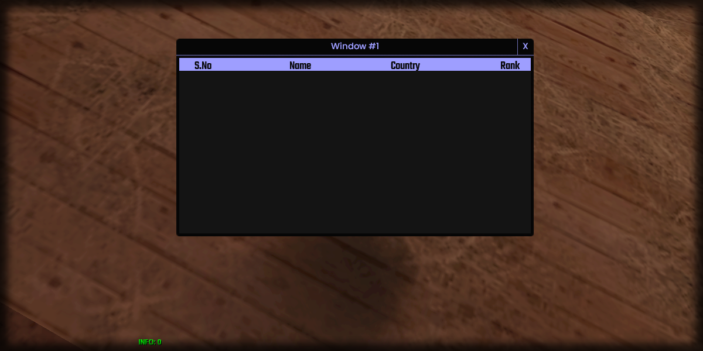

# countRows

## **Syntax:**

```lua
count countRows(gridlist)
```

#### _**\#Counterpart:**_ [_**countColumns**_](countgridlistcolumns.md)

### **Parameters:**

* **gridlist** \(element\) : Gridlist element you wish to retrieve the row count of.

### **Returns:**

* **count** \(int\) : Number of rows.

## **Example:**

```lua
local totalRows = beautify.gridlist.countRows(createdGridlist)
print(totalRows)
```



