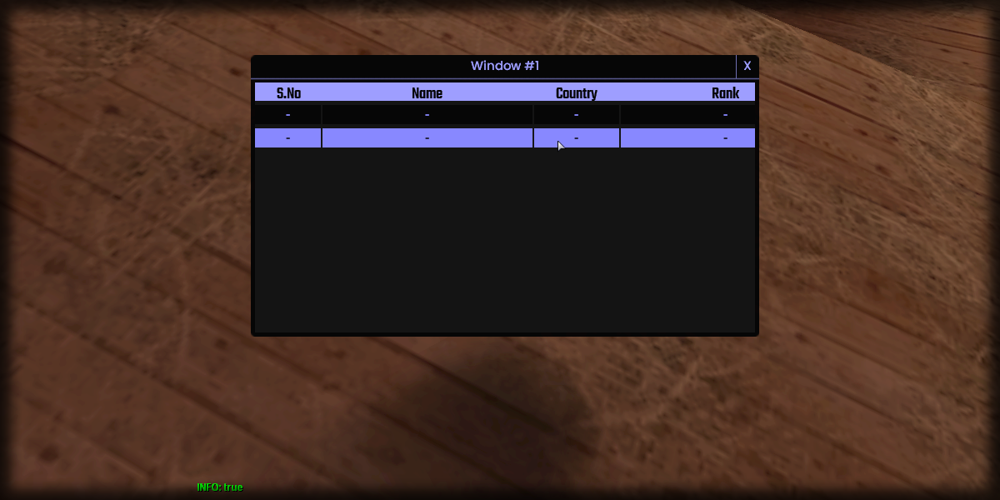

# removeRow

## **Syntax:**

```lua
state removeRow(gridlist, row)
```

#### _**\#Counterpart:**_ [_**addRow**_](https://github.com/OvileAmriam/MTA-Beautify-Library/tree/d5ddcfde36858ae1dbab45c2af2df9041d9b7aee/elements/gridlist/addRow.md)

### **Parameters:**

* **gridlist** \(element\) : Gridlist element you wish to remove the row from.
* **row** \(int\) : Index of the row you wish to remove.

### **Returns:**

* **state** \(bool\) : Execution state.

## **Example:**

```lua
local resultState = beautify.gridlist.removeRow(createdGridlist, 1)
print(tostring(resultState))
```



