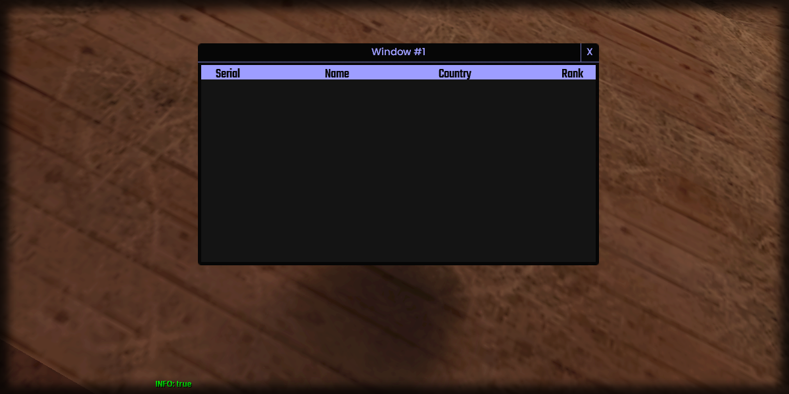

# setColumnName

## **Syntax:**

```lua
state setColumnName(gridlist, column, name)
```

#### _**\#Counterpart:**_ [_**getColumnName**_](getgridlistcolumnname.md)

### **Parameters:**

* **gridlist** \(element\) : Gridlist element you wish to update the column name of.
* **column** \(int\) : Index of the column you wish to update.
* **name** \(string\) : Name of the column.

### **Returns:**

* **state** \(bool\) : Execution state.

## **Example:**

```lua
local resultState = beautify.gridlist.setColumnName(createdGridlist, 1, "Serial")
print(tostring(resultState))
```



