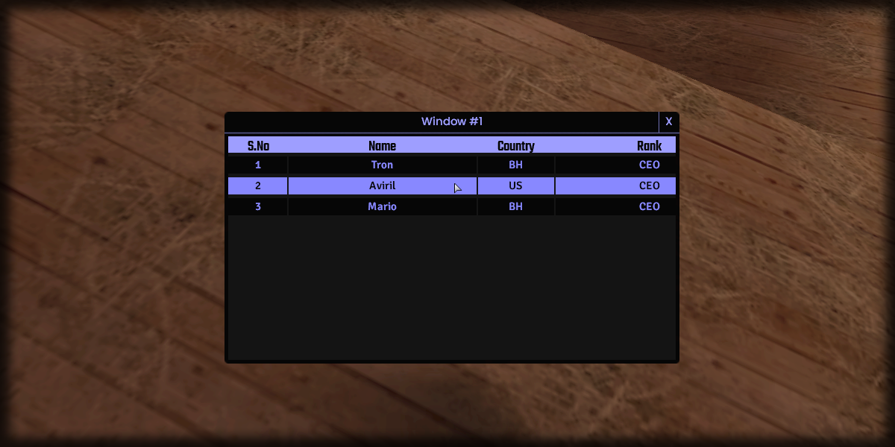

# setRowData

## **Syntax:**

```lua
state setRowData(gridlist, row, column, data)
```

#### _**\#Counterpart:**_ [_**getRowData**_](getgridlistrowdata.md)

### **Parameters:**

* **gridlist** \(element\) : Gridlist element you wish to update the row data of.
* **row** \(int\) : Index of the row you wish to update.
* **column** \(int\) : Index of the column you wish to update.
* **data** \(string\) : Data of row's column.

### **Returns:**

* **state** \(bool\) : Execution state.

## **Example:**

```lua
beautify.gridlist.setRowData(createdGridlist, 1, 1, "1")
beautify.gridlist.setRowData(createdGridlist, 1, 2, "Tron")
beautify.gridlist.setRowData(createdGridlist, 1, 3, "BH")
beautify.gridlist.setRowData(createdGridlist, 1, 4, "CEO")

beautify.gridlist.setRowData(createdGridlist, 2, 1, "2")
beautify.gridlist.setRowData(createdGridlist, 2, 2, "Aviril")
beautify.gridlist.setRowData(createdGridlist, 2, 3, "US")
beautify.gridlist.setRowData(createdGridlist, 2, 4, "CEO")

beautify.gridlist.setRowData(createdGridlist, 3, 1, "3")
beautify.gridlist.setRowData(createdGridlist, 3, 2, "Mario")
beautify.gridlist.setRowData(createdGridlist, 3, 3, "BH")
beautify.gridlist.setRowData(createdGridlist, 3, 4, "CEO")
```



