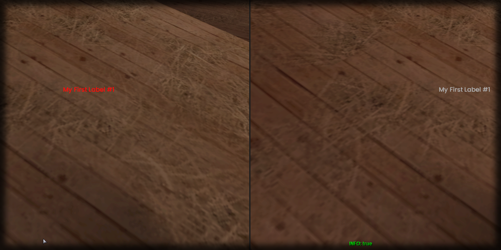

# clearColor

## **Syntax:**

```lua
state clearLabelColor(label)
```

### **Parameters:**

* **label** \(element\) : Label element you wish to clear the overrode color of.

### **Returns:**

* **state** \(bool\) : Execution state.

## **Example:**

```lua
local resultState = beautify.label.clearLabelColor(createdLabel)
print(tostring(resultState))
```



