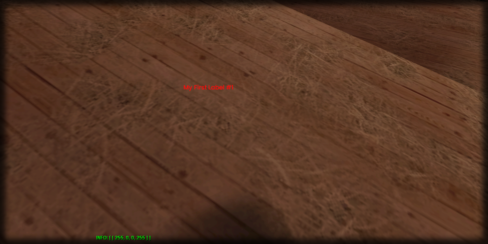

# getLabelColor

## **Syntax:**

```lua
color getLabelColor(label)
```

#### _**\#Counterpart:**_ [_**setLabelColor**_](setlabelcolor.md)

### **Parameters:**

* **label** \(element\) : Label element you wish to retrieve the color of.

### **Returns:**

* **color** \(table\) : Table containing color of the label.

## **Example:**

```lua
local labelColor = beautify.label.getLabelColor(createdLabel)
print(toJSON(labelColor))
```



