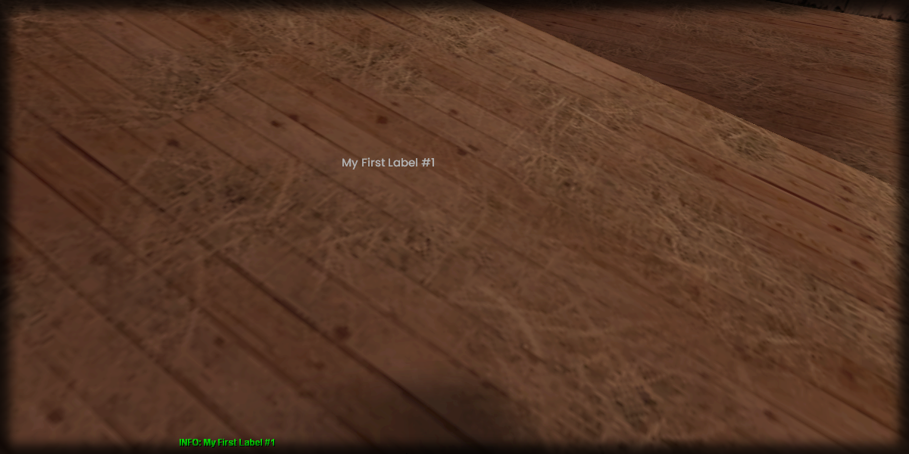

# getText

## **Syntax:**

```lua
text getText(label)
```

#### _**\#Counterpart:**_ [_**setText**_](setlabeltext.md)

### **Parameters:**

* **label** \(element\) : Label element you wish to retrieve the text of.

### **Returns:**

* **text** \(string\) : Text of the label.

## **Example:**

```lua
local labelText = beautify.label.getText(createdLabel)
print(labelText)
```



