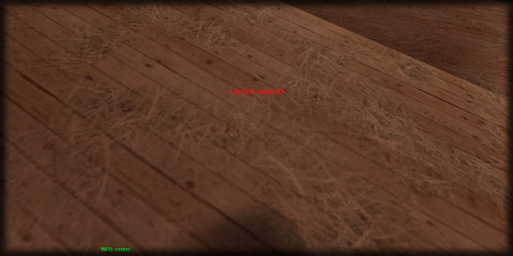

# getLabelVerticalAlignment

## **Syntax:**

```lua
alignment getLabelVerticalAlignment(label)
```

#### _**\#Counterpart:**_ [_**setLabelVerticalAlignment**_](setlabelverticalalignment.md)

### **Parameters:**

* **label** \(element\) : Label element you wish to retrieve the vertical alignment of.

### **Returns:**

* **alignment** \(string\) : Vertical alignment of the label.

## **Example:**

```lua
local labelVerticalAlignment = beautify.label.getLabelVerticalAlignment(createdLabel)
print(labelVerticalAlignment)
```



