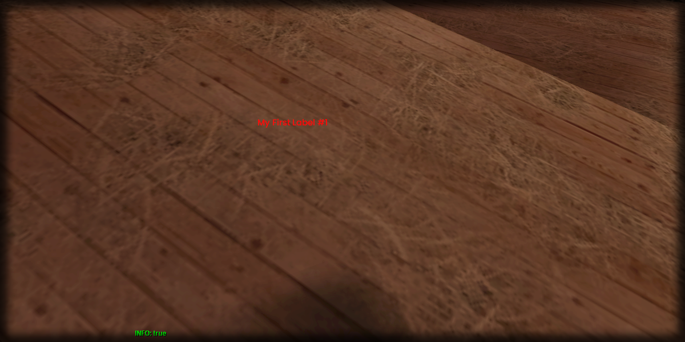

# setColor

## **Syntax:**

```lua
state setColor(label, color)
```

#### _**\#Counterpart:**_ [_**getColor**_](getlabelcolor.md)

### **Parameters:**

* **label** \(element\) : Label element you wish to set the color of.
* **color** \(table\) : Table containing color of the label.

### **Returns:**

* **state** \(bool\) : Execution state.

## **Example:**

```lua
local resultState = beautify.label.setColor(createdLabel, {255, 0, 0, 255})
print(tostring(resultState))
```



