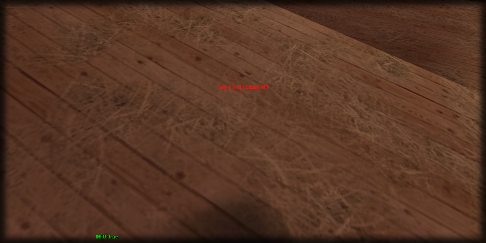

# setLabelHorizontalAlignment

## **Syntax:**

```lua
state setLabelHorizontalAlignment(label, alignment)
```

#### _**\#Counterpart:**_ [_**getLabelHorizontalAlignment**_](getlabelhorizontalalignment.md)

### **Parameters:**

* **label** \(element\) : Label element you wish to set the horizontal alignment of.
* **alignment** \(string\) : Horizontal alignment of the label \(left/center/right\).

### **Returns:**

* **state** \(bool\) : Execution state.

## **Example:**

```lua
local resultState = beautify.label.setLabelHorizontalAlignment(createdLabel, "center")
print(tostring(resultState))
```



