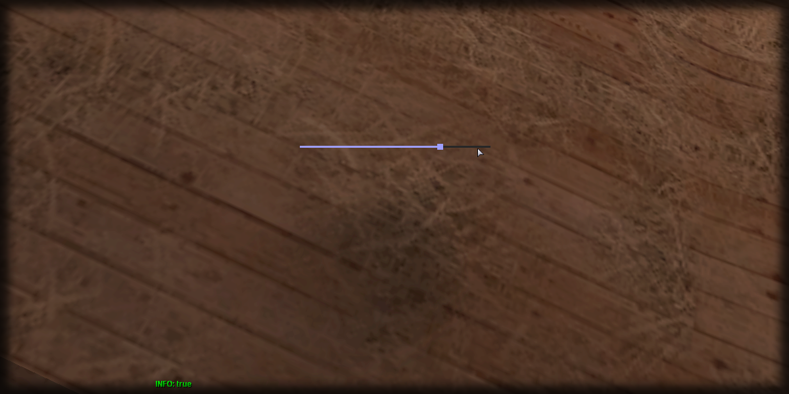

# clearText

## **Syntax:**

```lua
state clearText(slider)
```

### **Parameters:**

* **slider** \(element\) : Slider element you wish to clear the text of.

### **Returns:**

* **state** \(bool\) : Execution state.

## **Example:**

```lua
local resultState = beautify.slider.clearText(createdSlider)
print(tostring(resultState))
```



