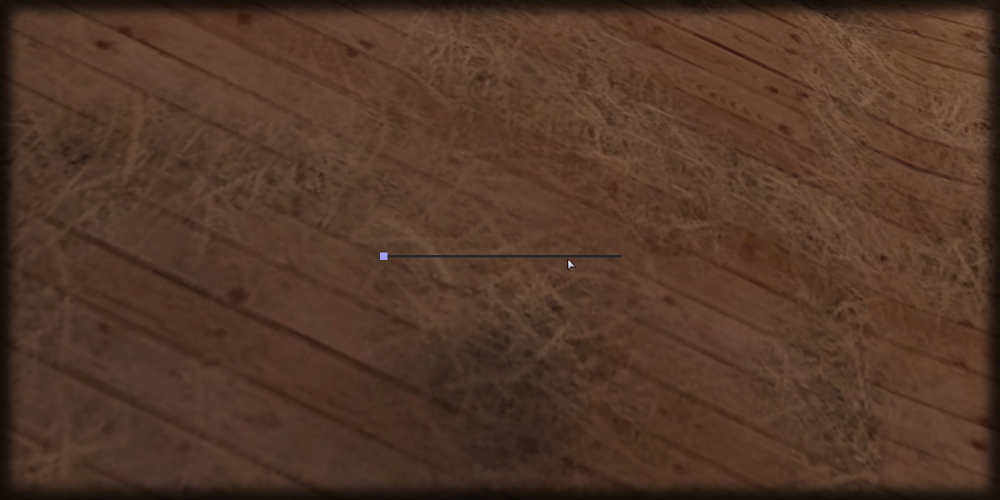

# create

## **Syntax:**

```lua
slider create(x, y, width, height, type, [parent = nil], [postGUI = false])
```

### **Parameters:**

* **x** \(float\) : Absolute x coordinate of the slider within the container.
* **y** \(float\) : Absolute y coordinate of the slider within the container.
* **width** \(float\) : Absolute width of the slider.
* **height** \(float\) : Absolute height of the slider.
* **type** \(string\) : Type of slider \(horizontal\vertical\).
* **parent** \(element\) : Supported parent element to use as a container for the slider. \(_Optional_\)
* **postGUI** \(bool\) : State whether the UI will be drawn below/over CEGUI. \(_Optional_\)

### **Returns:**

* **slider** \(element\) : Created slider element.

## **Example:**

```lua
local sX, sY = guiGetScreenSize()
local slider_width, slider_height = 300, 50
local createdSlider = beautify.slider.create((sX - slider_width)/2, (sY - slider_height)/2, slider_width, slider_height, "horizontal", nil, false)
beautify.setUIVisible(createdSlider, true)
```



