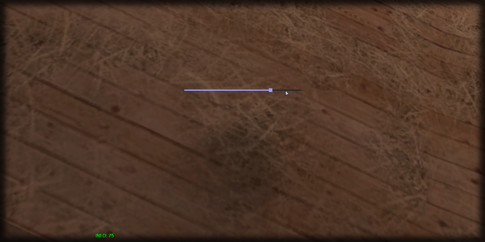

# getSliderPercent

## **Syntax:**

```lua
percent getSliderPercent(slider)
```

#### _**\#Counterpart:**_ [_**setSliderPercent**_](setsliderpercent.md)

### **Parameters:**

* **slider** \(element\) : Slider element you wish to retrieve the percentage of.

### **Returns:**

* **percent** \(float\) : Percentage of the slider.

## **Example:**

```lua
local sliderPercent = beautify.slider.getSliderPercent(createdSlider)
print(sliderPercent)
```



