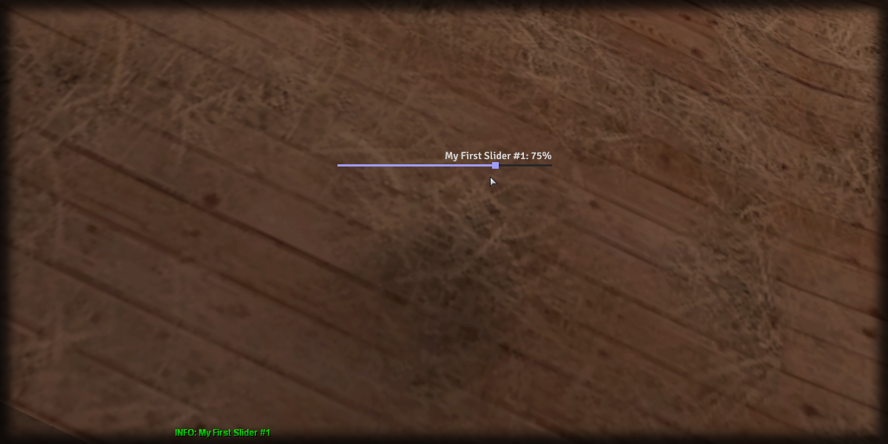

# getText

## **Syntax:**

```lua
text getText(slider)
```

#### _**\#Counterpart:**_ [_**setText**_](setslidertext.md)

### **Parameters:**

* **slider** \(element\) : Slider element you wish to retrieve the text of.

### **Returns:**

* **text** \(string\) : Text of the slider.

## **Example:**

```lua
local sliderText = beautify.slider.getText(createdSlider)
print(sliderText)
```



