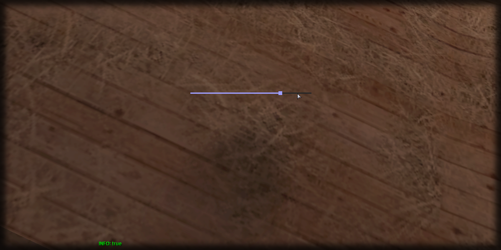

# setPercent

## **Syntax:**

```lua
state setPercent(slider, percent)
```

#### _**\#Counterpart:**_ [_**getPercent**_](getsliderpercent.md)

### **Parameters:**

* **slider** \(element\) : Slider element you wish to set the percentage of.
* **percent** \(float\) : Percentage of the slider.

### **Returns:**

* **state** \(bool\) : Execution state.

## **Example:**

```lua
local resultState = beautify.slider.setPercent(createdSlider, 75)
print(tostring(resultState))
```



