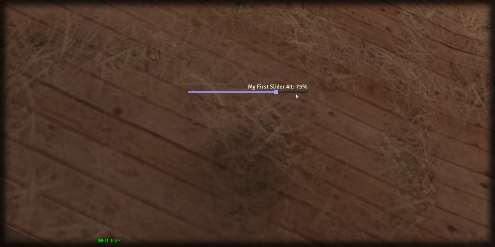

# setText

## **Syntax:**

```lua
state setText(slider, text)
```

#### _**\#Counterpart:**_ [_**getText**_](getslidertext.md)

### **Parameters:**

* **slider** \(element\) : Slider element you wish to set the text of.
* **text** \(string\) : Text of the slider.

### **Returns:**

* **state** \(bool\) : Execution state.

## **Example:**

```lua
local resultState = beautify.slider.setText(createdSlider, "My First Slider #1")
print(tostring(resultState))
```



